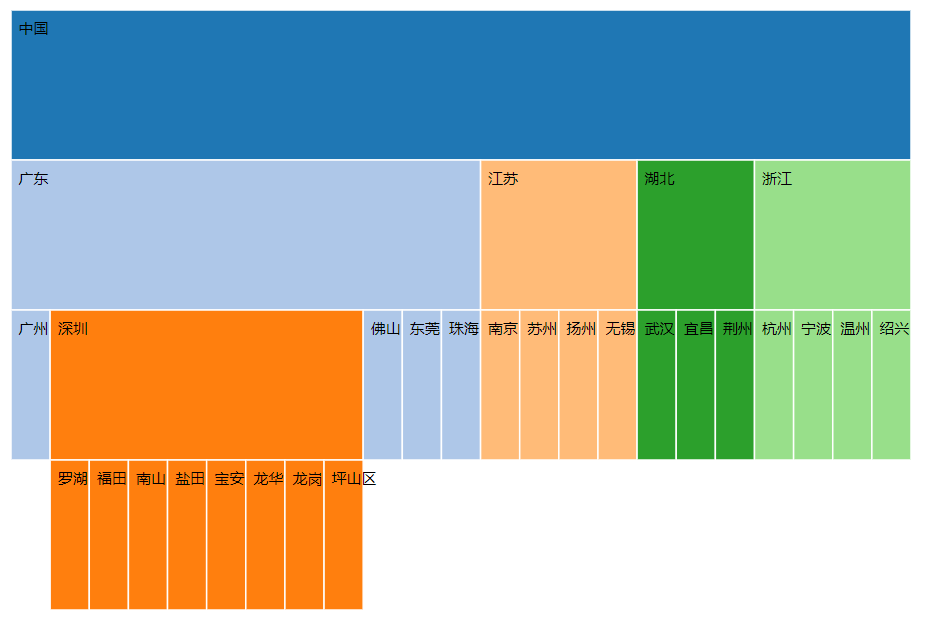

# D3.js 进阶篇: 分区图 Partition

`分区图`用于表示`包含与被包含关系`。

分区图可以是`方形`的，也可以是`圆形`。本节示例是最基本的形式方形分区图。

## 数据

本文使用的数据如下，这是各城市所属关系的数据。

`city_tree.json`:

```json
{
  "name": "中国",
  "children": [
    {
      "name": "广东",
      "children": [
        {
          "name": "广州"
        },
        {
          "name": "深圳",
          "children": [
            {
              "name": "罗湖区"
            },
            {
              "name": "福田区"
            },
            {
              "name": "南山区"
            },
            {
              "name": "盐田区"
            },
            {
              "name": "宝安区"
            },
            {
              "name": "龙华区"
            },
            {
              "name": "龙岗区"
            },
            {
              "name": "坪山区"
            }
          ]
        },
        {
          "name": "佛山"
        },
        {
          "name": "东莞"
        },
        {
          "name": "珠海"
        }
      ]
    },
    {
      "name": "江苏",
      "children": [
        {
          "name": "南京"
        },
        {
          "name": "苏州"
        },
        {
          "name": "扬州"
        },
        {
          "name": "无锡"
        }
      ]
    },
    {
      "name": "湖北",
      "children": [
        {
          "name": "武汉"
        },
        {
          "name": "宜昌"
        },
        {
          "name": "荆州"
        }
      ]
    },
    {
      "name": "浙江",
      "children": [
        {
          "name": "杭州"
        },
        {
          "name": "宁波"
        },
        {
          "name": "温州"
        },
        {
          "name": "绍兴"
        }
      ]
    }
  ]
}
```

## 布局：数据转换

定义一个分区图的布局：

```js
var partition = d3.layout
  .partition()
  .sort(null)
  .size([width, height])
  .value(function(d) {
    return 1;
  });
```

API 解释：

- sort(): 设置内部的顶点的排序函数，null 表示不排序。
- size(): 设置转换后图形的范围，这个值很重要，运用得当可变为圆形分区图。
- value(): 设置表示分区大小的值。如果数据文件中用 size 值表示结点大小，那么这里可写成 `return d.size`。

接下来读取并转换数据:

```js
d3.json("./json/city_tree.json", function(error, root) {
  if (error) {
    console.log(error);
  }
  console.log(root);

  //转换数据
  var nodes = partition.nodes(root);
  var links = partition.links(nodes);

  //输出转换后的顶点
  console.log(nodes);
});
```

顶点中增加了以下几个属性：

- x: 顶点的 x 坐标位置
- y：顶点的 y 坐标位置
- dx：顶点的宽度 dx
- dy：顶点的高度 dy

## 绘图

绑定节点数据，分别添加矩形和文字:

```js
//绘制图形
var rects = svg
  .selectAll("g")
  .data(nodes)
  .enter()
  .append("g");

rects
  .append("rect")
  .attr("x", function(d) {
    return d.x;
  })
  .attr("y", function(d) {
    return d.y;
  })
  .attr("width", function(d) {
    return d.dx;
  })
  .attr("height", function(d) {
    return d.dy;
  })
  .style("stroke", "#fff")
  .style("fill", function(d) {
    return color((d.children ? d : d.parent).name);
  })
  .on("mouseover", function(d) {
    d3.select(this).style("fill", "yellow");
  })
  .on("mouseout", function(d) {
    d3.select(this)
      .transition()
      .duration(200)
      .style("fill", function(d) {
        return color((d.children ? d : d.parent).name);
      });
  });

rects
  .append("text")
  .attr("class", "node_text")
  .attr("dominant-baseline", "text-before-edge")
  .attr("transform", function(d, i) {
    return "translate(" + (d.x + 5) + "," + (d.y + 5) + ")";
  })
  .text(function(d, i) {
    return d.name;
  });
```

## 效果


