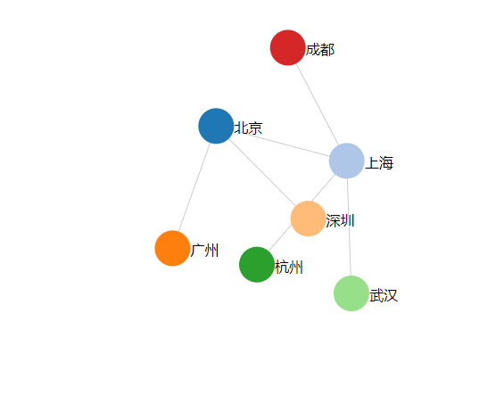

# D3.js 进阶篇： 力导向图 Force-Directed Graph

力导向图（Force-Directed Graph），是绘图的一种算法。在二维或三维空间里配置节点，节点之间用线连接，称为连线。各连线的长度几乎相等，且尽可能不相交。节点和连线都被施加了力的作用，力是根据节点和连线的相对位置计算的。根据力的作用，来计算节点和连线的运动轨迹，并不断降低它们的能量，最终达到一种能量很低的安定状态。

力导向图能表示节点之间的`多对多`的关系。

## 数据

初始数据如下：

```js
var nodes = [
  { name: "北京" },
  { name: "上海" },
  { name: "广州" },
  { name: "深圳" },
  { name: "杭州" },
  { name: "武汉" },
  { name: "成都" }
];

var edges = [
  { source: 0, target: 1 },
  { source: 0, target: 2 },
  { source: 0, target: 3 },
  { source: 1, target: 4 },
  { source: 1, target: 5 },
  { source: 1, target: 6 }
];
```

节点（nodes）和连线（edges）的数组，节点是一些城市名，连线的两端是节点的序号（序号从 0 开始）。

这些数据是不能作图的，因为不知道节点和连线的坐标。这就需要用到布局 `d3.layout.force()`。

## 布局（数据转换）

定义一个力导向图的布局如下:

```js
var force = d3.layout
  .force()
  .nodes(nodes) //指定节点数组
  .links(edges) //指定连线数组
  .size([width, height]) //指定作用域范围
  .linkDistance(150) //指定连线长度
  .charge([-400]); //相互之间的作用力
```

然后，使力学作用生效：

```js
force.start(); //开始作用
```

如此，数组 nodes 和 edges 的数据都发生了变化。在控制台输出一下，看看发生了什么变化。

```js
console.log(nodes);
/* [
  { name: "北京", index: 0, weight: 3, x: 416.731015070514, y: 406.571216379642, px: 416.75777165133513, py: 406.5221099724545 },
  { name: "上海", index: 1, weight: 4, x: 402.0758734030152, y: 259.7579381041645, px: 402.03095126848456, py: 259.78361262167084 },
  { name: "广州", index: 2, weight: 1, x: 278.4548849520538, y: 361.12224108667823, px: 278.5138322989122, py: 361.13015444417437 },
  { name: "深圳", index: 3, weight: 1, x: 326.4878662217116, y: 286.31234859227766, px: 326.51086981745925, py: 286.34634439991936 },
  { name: "杭州", index: 4, weight: 1, x: 543.6856427534746, y: 244.24188182041308, px: 543.6082604344327, py: 244.2377531694227 },
  { name: "武汉", index: 5, weight: 1, x: 504.2438305273001, y: 363.5960492555496, px: 504.21360420259936, py: 363.53697194368715 },
  { name: "成都", index: 6, weight: 1, x: 353.77990149081234, y: 128.2949171803144, px: 353.8333046085525, py: 128.31993227999467 }
]; */
console.log(edges);
/* [
  {
    source: { name: "北京", index: 0, weight: 3, x: 416.731015070514, y: 406.571216379642, px: 416.75777165133513, py: 406.5221099724545 },
    target: { name: "上海", index: 1, weight: 4, x: 402.0758734030152, y: 259.7579381041645, px: 402.03095126848456, py: 259.78361262167084 }
  },
  {
    source: { name: "北京", index: 0, weight: 3, x: 416.731015070514, y: 406.571216379642, px: 416.75777165133513, py: 406.5221099724545 },
    target: { name: "广州", index: 2, weight: 1, x: 278.4548849520538, y: 361.12224108667823, px: 278.5138322989122, py: 361.13015444417437 }
  },
  {
    source: { name: "北京", index: 0, weight: 3, x: 416.731015070514, y: 406.571216379642, px: 416.75777165133513, py: 406.5221099724545 },
    target: { name: "深圳", index: 3, weight: 1, x: 326.4878662217116, y: 286.31234859227766, px: 326.51086981745925, py: 286.34634439991936 }
  },
  {
    source: { name: "上海", index: 1, weight: 4, x: 402.0758734030152, y: 259.7579381041645, px: 402.03095126848456, py: 259.78361262167084 },
    target: { name: "杭州", index: 4, weight: 1, x: 543.6856427534746, y: 244.24188182041308, px: 543.6082604344327, py: 244.2377531694227 }
  },
  {
    source: { name: "上海", index: 1, weight: 4, x: 402.0758734030152, y: 259.7579381041645, px: 402.03095126848456, py: 259.78361262167084 },
    target: { name: "武汉", index: 5, weight: 1, x: 504.2438305273001, y: 363.5960492555496, px: 504.21360420259936, py: 363.53697194368715 }
  },
  {
    source: { name: "上海", index: 1, weight: 4, x: 402.0758734030152, y: 259.7579381041645, px: 402.03095126848456, py: 259.78361262167084 },
    target: { name: "成都", index: 6, weight: 1, x: 353.77990149081234, y: 128.2949171803144, px: 353.8333046085525, py: 128.31993227999467 }
  }
]; */
```

## 绘图

有了转换后的数据，就可以作图了。分别绘制三种图形元素：

- line - 线段，表示连线。
- circle - 圆，表示节点。
- text - 文字，描述节点。

代码如下：

```js
//添加连线
var svg_edges = svg
  .selectAll("line")
  .data(edges)
  .enter()
  .append("line")
  .style("stroke", "#ccc")
  .style("stroke-width", 1);

var color = d3.scale.category20();

//添加节点
var svg_nodes = svg
  .selectAll("circle")
  .data(nodes)
  .enter()
  .append("circle")
  .attr("r", 20)
  .style("fill", function(d, i) {
    return color(i);
  })
  .call(force.drag); //使得节点能够拖动

//添加描述节点的文字
var svg_texts = svg
  .selectAll("text")
  .data(nodes)
  .enter()
  .append("text")
  .style("fill", "black")
  .attr("dx", 20)
  .attr("dy", 8)
  .text(function(d) {
    return d.name;
  });
```

调用 call( force.drag ) 后节点可被拖动。`force.drag()` 是一个函数，将其作为 call() 的参数，相当于将`当前选择的元素`传到 force.drag() 函数中。

由于力导向图是不断运动的，每一时刻都在发生更新，因此，必须`不断更新节点和连线的位置`。力导向图布局 force 有一个 `tick` 事件，每进行到一个时刻，都要调用它，更新的内容就写在它的回调函数中。

```js
force.on("tick", function() {
  //对于每一个时间间隔
  //更新连线坐标
  svg_edges
    .attr("x1", function(d) {
      return d.source.x;
    })
    .attr("y1", function(d) {
      return d.source.y;
    })
    .attr("x2", function(d) {
      return d.target.x;
    })
    .attr("y2", function(d) {
      return d.target.y;
    });

  //更新节点坐标
  svg_nodes
    .attr("cx", function(d) {
      return d.x;
    })
    .attr("cy", function(d) {
      return d.y;
    });

  //更新文字坐标
  svg_texts
    .attr("x", function(d) {
      return d.x;
    })
    .attr("y", function(d) {
      return d.y;
    });
});
```

## 效果


