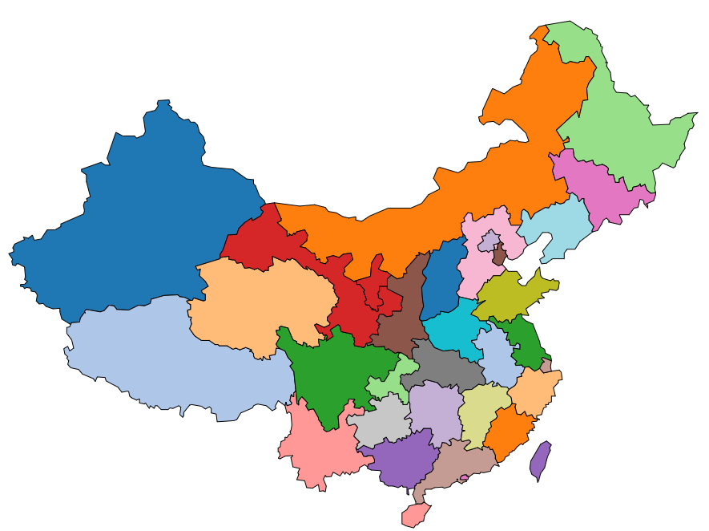

# D3.js 进阶篇： 地图 Geo Graph

在数据可视化中，地图是很重要的一部分。很多情况会与地图有关联，如中国各省的人口多少，GDP 多少等，都可以和地图联系在一起。

## 地图数据的获取

制作地图需要 JSON 文件。将 JSON 的格式应用于地理上的文件，叫做 GeoJSON 文件。本文就是用这种文件绘制地图。

那么如何获取中国地图的 GeoJSON 文件呢，真的有点麻烦，可以参照： https://github.com/clemsos/d3-china-map 进行制作。这不仅需要安装一些东西，还要研究一下制作方法，对想直接下载获取中国地图的 GeoJSON 文件的朋友可能感觉很不舒服，呵呵，其实我也是这样。

中国地图的 GeoJSON 文件： china.geojson

## 投影函数: 转换经纬度

```js
var projection = d3.geo
  .mercator()
  .center([107, 31]) // 设置地图的中心位置，[107,31] 指的是经度和纬度
  .scale(850) // 设置放大的比例
  .translate([width / 2, height / 2]); // 设置平移
```

由于 GeoJSON 文件中的地图数据，都是经度和纬度的信息，是三维的，而在网页上需要显示的是二维的信息，所以需要通过一个`投影函数`来转换`经度纬度`。

如上所示，使用 `d3.geo.mercator()` 的投影方式。各种投影的函数，可以参考 D3 官方文档： https://github.com/mbostock/d3/wiki/Geo-Projections

## 地理路径生成器: d3.geo.path()

为了根据地图的地理数据生成 SVG 中 path 元素的路径值，需要用到 `d3.geo.path()`，我们称它为`地理路径生成器`。

```js
var path = d3.geo.path().projection(projection);
```

projection() 是设置生成器的投影函数，把上面定义的投影传入即可。以后，当使用此生成器计算路径时，会自己加入投影的影响。

## 向服务器请求文件并绘制地图

```js
d3.json("json/china.json", function(error, root) {
  if (error) return console.error(error);
  console.log(root.features);

  svg
    .selectAll("path")
    .data(root.features)
    .enter()
    .append("path")
    .attr("stroke", "#000")
    .attr("stroke-width", 1)
    .attr("fill", function(d, i) {
      return color(i);
    })
    .attr("d", path) //使用地理路径生成器
    .on("mouseover", function(d, i) {
      d3.select(this).attr("fill", "yellow");
    })
    .on("mouseout", function(d, i) {
      d3.select(this).attr("fill", color(i));
    });
});
```

给 svg 中添加 path 元素。本例中，每一个 path 表示一个省。要注意 `.attr("d",path)` 这一行代码相当于：

```js
.attr("d",funtion(d){
    return path(d);
})
```

这种省略用法是很常用的。

## 效果


