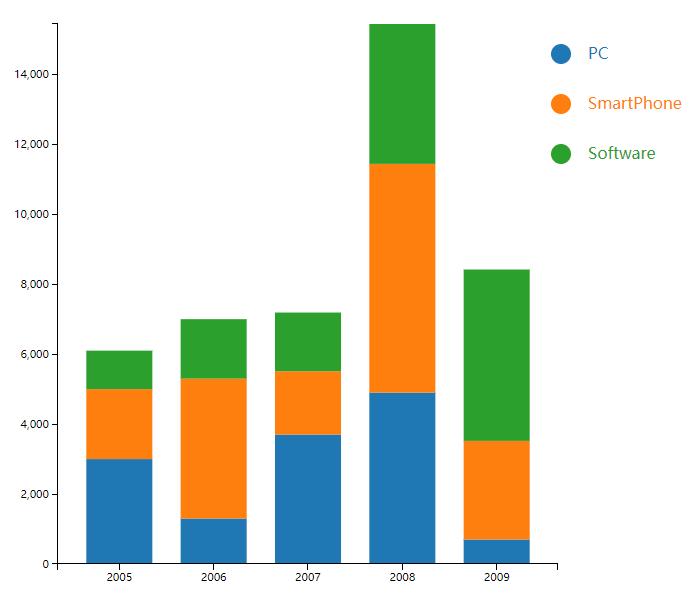

# D3.js 进阶篇: 堆栈图 Stack

## 什么是堆栈图

例设有如下情况：

某公司，销售三种产品：个人电脑、智能手机、软件。

2005 年，三种产品的利润分别为 3000、2000、1100 万。

2006 年，三种产品的利润分别为 1300、4000、1700 万。

计算可得，2005 年总利润为 6100 万，2006 年为 7000 万。

如果要将 2005 年的利润用柱形表示，那么应该画三个矩形，三个矩形堆叠在一起。这时候就有一个问题：每一个矩形的起始 y 坐标是多少，高应该是多少。

输入数组，直接计算出上述问题的，就是堆栈图布局。

## 数据

假设某公司销售个人电脑、智能手机、软件的数据如下

```js
var dataset = [
  {
    name: "PC",
    sales: [
      { year: 2005, profit: 3000 },
      { year: 2006, profit: 1300 },
      { year: 2007, profit: 3700 },
      { year: 2008, profit: 4900 },
      { year: 2009, profit: 700 }
    ]
  },
  {
    name: "SmartPhone",
    sales: [
      { year: 2005, profit: 2000 },
      { year: 2006, profit: 4000 },
      { year: 2007, profit: 1810 },
      { year: 2008, profit: 6540 },
      { year: 2009, profit: 2820 }
    ]
  },
  {
    name: "Software",
    sales: [
      { year: 2005, profit: 1100 },
      { year: 2006, profit: 1700 },
      { year: 2007, profit: 1680 },
      { year: 2008, profit: 4000 },
      { year: 2009, profit: 4900 }
    ]
  }
];
```

## 布局：数据转换

堆栈图布局（Stack Layout）能够计算二维数组每一数据层的基线，以方便将各数据层叠加起来。

先定义一个堆栈图的布局：

```js
var stack = d3.layout
  .stack()
  .values(function(d) {
    return d.sales;
  })
  .x(function(d) {
    return d.year;
  })
  .y(function(d) {
    return d.profit;
  });
```

对数据进行转换：

```js
var data = stack(dataset);
console.log(data);
```

要注意，转换之后原数据也会改变，因此 dataset 和 data 的值是一样的。sales 的每一项都多了两个值：`y0` 和 `y`。y0 即该层`起始坐标`，y 是`高度`。x 坐标是 `year`。

## 绘图

首先要创建 x 轴和 y 轴比例尺，在添加图形元素和坐标轴的时候都要用到。要绘制坐标轴，要立刻想到要给坐标轴的刻度留出一部分空白。

### 先定义一个外边框对象:

```js
var margin = { left: 50, right: 100, top: 30, bottom: 30 };
```

### 定义 x 轴比例尺

```js
var xRangeWidth = width - margin.left - margin.right;

var xScale = d3.scale
  .ordinal()
  .domain(
    data[0].sales.map(function(d) {
      return d.year;
    })
  )
  .rangeBands([0, xRangeWidth], 0.3);
```

本例中 x 轴代表年份，2005 年、2006 年、2007 年等，是`离散`的，也就是说比例尺的`定义域`是离散的。因此，用到了序数比例尺 `d3.scale.ordinal()`。

上面代码将定义域设定成：

```js
[2005, 2006, 2007, 2008, 2009];
```

值域是根据 `rangeBands()`计算的，实际是：

```js
[31, 134, 238, 342, 446]; //（省略了小数点）
```

因此，在 2005 年处堆叠的矩形的 x 坐标为 31。

### 定义 y 轴的比例尺

```js
//最大利润（定义域的最大值）
var maxProfit = d3.max(data[data.length - 1].sales, function(d) {
  return d.y0 + d.y;
});

//最大高度（值域的最大值）
var yRangeWidth = height - margin.top - margin.bottom;

var yScale = d3.scale
  .linear()
  .domain([0, maxProfit]) //定义域
  .range([0, yRangeWidth]); //值域
```

### 定义颜色比例尺

添加分组元素<g>，每一个分组代表一种产品，每一种产品都用一种颜色来标识。

```js
//颜色比例尺
var color = d3.scale.category10();

//添加分组元素
var groups = svg
  .selectAll("g")
  .data(data)
  .enter()
  .append("g")
  .style("fill", function(d, i) {
    return color(i);
  });
```

### 绘制图形

添加矩形：

```js
var rects = groups
  .selectAll("rect")
  .data(function(d) {
    return d.sales;
  })
  .enter()
  .append("rect")
  .attr("x", function(d) {
    return xScale(d.year);
  })
  .attr("y", function(d) {
    return yRangeWidth - yScale(d.y0 + d.y);
  })
  .attr("width", function(d) {
    return xScale.rangeBand();
  })
  .attr("height", function(d) {
    return yScale(d.y);
  })
  .attr("transform", "translate(" + margin.left + "," + margin.top + ")");
```

在图表旁边添加图形标志 和 文字说明：

```js
var labHeight = 50;
var labRadius = 10;

var labelCircle = groups
  .append("circle")
  .attr("cx", function(d) {
    return width - margin.right * 0.98;
  })
  .attr("cy", function(d, i) {
    return margin.top * 2 + labHeight * i;
  })
  .attr("r", labRadius);

var labelText = groups
  .append("text")
  .attr("x", function(d) {
    return width - margin.right * 0.8;
  })
  .attr("y", function(d, i) {
    return margin.top * 2 + labHeight * i;
  })
  .attr("dy", labRadius / 2)
  .text(function(d) {
    return d.name;
  });
```

## 效果


