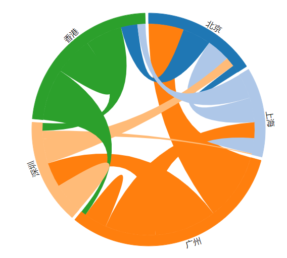

# D3.js 进阶篇： 弦图 Chord

## 弦图是什么

弦图 可以显示不同实体之间的相互关系和彼此共享的一些共通之处，因此这种图表非常适合用来`比较数据集`或`不同数据组之间的相似性`。

节点围绕着圆周分布，点与点之间以弧线或贝塞尔曲线彼此连接以显示当中关系，然后再给每个连接分配数值（通过每个圆弧的大小比例表示）。此外，也可以用颜色将数据分成不同类别，有助于进行比较和区分。

### 缺点

尤当要显示太多连接的时候，过于混乱。

## 数据

初始数据为：

```js
var city_name = ["北京", "上海", "广州", "深圳", "香港"];

var population = [
  [1000, 3045, 4567, 1234, 3714],
  [3214, 2000, 2060, 124, 3234],
  [8761, 6545, 3000, 8045, 647],
  [3211, 1067, 3214, 4000, 1006],
  [2146, 1034, 6745, 4764, 5000]
];
```

数据是一些城市名和一些数字，这些数字表示城市人口的来源。其意思如下：

|      | 北京 | 上海 |
| ---- | ---- | ---- |
| 北京 | 1000 | 3045 |
| 上海 | 3214 | 2000 |

左边第一列是被统计人口的城市，上边第一行是被统计的来源城市，即：

北京市的人口有 1000 个人来自本地，有 3045 人是来自上海的移民，总人口为 1000 + 3045。

上海市的人口有 2000 个人来自本地，有 3214 人是来自北京的移民，总人口为 3214 + 2000。

## 布局

### 定义一个弦图的布局

```js
var chord_layout = d3.layout
  .chord()
  .padding(0.03) //节点之间的间隔
  .sortSubgroups(d3.descending) //排序
  .matrix(population); //输入矩阵
```

### 应用布局转换数据

```js
var groups = chord_layout.groups();
var chords = chord_layout.chords();
```

population 经过转换后，实际上分成了两部分：groups 和 chords。前者是节点，后者是连线，也就是弦。chords 就是图中的连线。chords 里面又分为 source 和 target ，也就是连线的两端。

```js
console.log(groups);
console.log(chords);
```

## 绘图

### 绘制节点

```js
// 绘制节点（即分组，有多少个城市画多少个弧形），及绘制城市名称。
var outer_arc = d3.svg
  .arc()
  .innerRadius(innerRadius)
  .outerRadius(outerRadius);

var g_outer = svg.append("g");

g_outer
  .selectAll("path")
  .data(groups)
  .enter()
  .append("path")
  .style("fill", function(d) {
    return color20(d.index);
  })
  .style("stroke", function(d) {
    return color20(d.index);
  })
  .attr("d", outer_arc);

g_outer
  .selectAll("text")
  .data(groups)
  .enter()
  .append("text")
  .each(function(d, i) {
    d.angle = (d.startAngle + d.endAngle) / 2;
    d.name = city_name[i];
  })
  .attr("dy", ".35em")
  .attr("transform", function(d) {
    return (
      "rotate(" +
      (d.angle * 180) / Math.PI +
      ")" +
      "translate(0," +
      -1.0 * (outerRadius + 10) +
      ")" +
      (d.angle > (Math.PI * 3) / 4 && d.angle < (Math.PI * 5) / 4
        ? "rotate(180)"
        : "")
    );
  })
  .text(function(d) {
    return d.name;
  });
```

节点位于弦图的外部。节点数组 groups 的每一项，都有起始角度和终止角度，因此节点其实是用弧形来表示的，这与饼状图类似。

然后就是节点的文字（即城市名称），有两个地方要特别注意。

each()：表示对任何一个绑定数据的元素，都执行后面的无名函数 function(d,i) ，函数体里做两件事：

计算起始角度和终止角度的平均值，赋值给 d.angle 。
将 city_name[i] 城市名称赋值给 d.name 。
transform 的参数：用 translate 进行坐标变换时，要注意顺序： rotate -> translate（先旋转再平移）。 此外，

### 绘制连线

绘制连线（即所有城市人口的来源，即有 `5 * 5 = 25` 条弧）

```js
var inner_chord = d3.svg.chord().radius(innerRadius);

svg
  .append("g")
  .attr("class", "chord")
  .selectAll("path")
  .data(chords)
  .enter()
  .append("path")
  .attr("d", inner_chord) //
  .style("fill", function(d) {
    return color20(d.source.index);
  })
  .style("opacity", 1)
  .on("mouseover", function(d, i) {
    d3.select(this).style("fill", "yellow");
  })
  .on("mouseout", function(d, i) {
    d3.select(this)
      .transition()
      .duration(1000)
      .style("fill", color20(d.source.index));
  });
```

SVG 中没有现成的弦元素（例如圆有 `<circle>`，但是弦却没有 `<chord>`），需要用路径元素 `<path>` 来制作。D3 提供了 `d3.svg.chord()` ，只需要将`弦的对象`传递给它，即可得到路径值。

## 效果图


