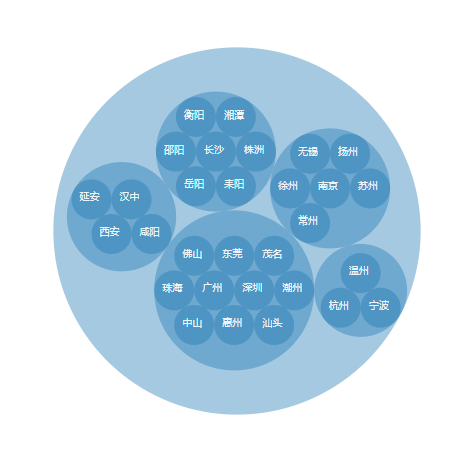

# D3.js 进阶篇: 打包图 Pack

打包图（ Pack ），用于表示`包含与被包含`的关系，也可表示`各对象的权重`。通常用圆形套圆形来表示包含与被包含的关系，用圆的大小来表示各对象的权重。

## 数据

这小节使用的是各城市所属关系的数据 `city2.json`。

## 布局：数据转换

先定义一个打包图的布局：

```js
var pack = d3.layout
  .pack()
  .size([width, height]) // 设定转换的范围，即转换后顶点的坐标(x,y)，都会在此范围内
  .radius(20); // radius() 设定转换后最小的圆的半径
```

读取数据并转换的代码：

```js
d3.json("./json/city2.json", function(error, root) {
  var nodes = pack.nodes(root);
  var links = pack.links(nodes);

  console.log(nodes);
  console.log(links);
});
```

用 pack 函数分别将数据转换成了顶点 nodes 和 连线 links。数据被转换后，多了深度信息(depth)，半径大小(r)，坐标位置(x,y)等属性。

## 绘图

绘制的内容有圆和文字

```js
// 绘制圆形
svg
  .selectAll("circle")
  .data(nodes)
  .enter()
  .append("circle")
  .attr("fill", "rgb(31, 119, 180)")
  .attr("fill-opacity", "0.4")
  .attr("cx", function(d) {
    return d.x;
  })
  .attr("cy", function(d) {
    return d.y;
  })
  .attr("r", function(d) {
    return d.r;
  })
  .on("mouseover", function(d, i) {
    d3.select(this).attr("fill", "yellow");
  })
  .on("mouseout", function(d, i) {
    d3.select(this).attr("fill", "rgb(31, 119, 180)");
  });

// 绘制文字
svg
  .selectAll("text")
  .data(nodes)
  .enter()
  .append("text")
  .attr("font-size", "10px")
  .attr("fill", "white")
  .attr("fill-opacity", function(d) {
    if (d.depth == 2) return "0.9";
    else return "0";
  })
  .attr("x", function(d) {
    return d.x;
  })
  .attr("y", function(d) {
    return d.y;
  })
  .attr("dx", -12)
  .attr("dy", 1)
  .text(function(d) {
    return d.name;
  });
```

## 效果


