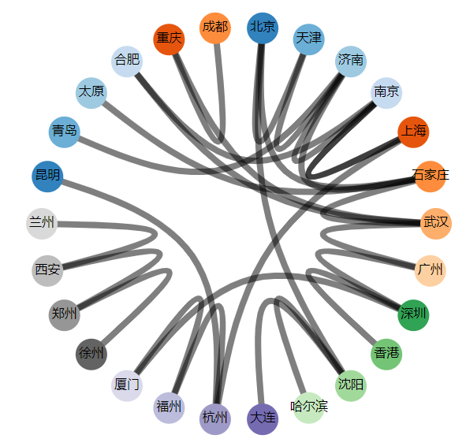

# D3.js 进阶篇: 捆图 Bundle

## 什么是捆图（Bundle）

捆图 是 D3 中比较奇特的一个布局，只有以下两个方法，而且需要与其它布局配合使用：

- d3.layout.bundle()：创建一个捆图布局。
- bundle(links)：根据数组 links 的 source 和 target，计算路径。

捆图的布局之所以方法少，是因为它常与其它层级布局一起使用。所谓`层级布局`，是指`采用嵌套结构（父子节点关系）来描述节点信息`，根据层级布局扩展出来的布局即：集群图、打包图、分区图、树状图、矩阵树图。

最常见的是与`集群图`一起使用，使用`集群图布局`计算节点的`位置`，再用`捆图布局`计算`连线路径`。也就是说，捆图布局只干一件事：

```
计算连线的路径。
```

现要制作一图来表示经过哪一座城市的高铁最密集。

## 数据

现有连接全国各主要城市的高铁的数组，如下：

```js
var railway = [
  { source: "北京", target: "天津" }, // 京沪高铁 京津段
  { source: "天津", target: "济南" }, // 津济段
  { source: "济南", target: "南京" }, // 济宁段
  { source: "南京", target: "上海" }, // 沪宁段
  { source: "北京", target: "石家庄" }, // 京港高铁 京石段
  { source: "石家庄", target: "武汉" }, //  石武段
  { source: "武汉", target: "广州" }, // 武广段
  { source: "广州", target: "深圳" }, // 广深段
  { source: "深圳", target: "香港" }, // 深港段
  { source: "北京", target: "沈阳" }, // 京哈高铁 京沈段
  { source: "沈阳", target: "哈尔滨" }, // 沈哈段
  { source: "沈阳", target: "大连" }, // 哈大高铁 沈大段
  { source: "杭州", target: "福州" }, // 杭福沈高铁 杭福段
  { source: "福州", target: "厦门" }, // 福厦段
  { source: "厦门", target: "深圳" }, // 厦深段
  { source: "徐州", target: "郑州" }, // 徐兰高铁 郑徐段
  { source: "郑州", target: "西安" }, // 郑西段
  { source: "西安", target: "兰州" }, // 西兰段
  { source: "上海", target: "杭州" }, // 沪昆高铁 沪杭段
  { source: "杭州", target: "昆明" }, // 杭昆段
  { source: "青岛", target: "济南" }, // 清太高铁 胶济段
  { source: "济南", target: "石家庄" }, // 石济段
  { source: "石家庄", target: "太原" }, // 石太段
  { source: "上海", target: "南京" }, // 沪汉蓉沿江高铁 沪宁段
  { source: "南京", target: "合肥" }, // 合宁段
  { source: "合肥", target: "武汉" }, // 合武段
  { source: "武汉", target: "重庆" }, // 汉渝段
  { source: "重庆", target: "成都" } // 成渝段
];
```

source 和 target 分别表示高铁的两端。

经计算，得出主要城市节点有 26 个。这 26 座城市所属的节点有一个公共的父节点，父节点名称为空，稍后并不绘制此父节点。

```js
var arr = [];
for (var i = 0; i < railway.length; i++) {
  var item = railway[i];
  if (arr.indexOf(item.source) == -1) {
    arr.push(item.source);
  }
  if (arr.indexOf(item.target) == -1) {
    arr.push(item.target);
  }
}

var cities = {
  name: "",
  children: []
};

cities.children = arr.map(function(item) {
  return {
    name: item
  };
});
console.log(cities);
// {
//   name: "",
//   children: [
//     { name: "北京" },
//     { name: "天津" },
//     { name: "济南" },
//     { name: "南京" },
//     { name: "上海" },
//     { name: "石家庄" },
//     { name: "武汉" },
//     { name: "广州" },
//     { name: "深圳" },
//     { name: "香港" },
//     { name: "沈阳" },
//     { name: "哈尔滨" },
//     { name: "大连" },
//     { name: "杭州" },
//     { name: "福州" },
//     { name: "厦门" },
//     { name: "徐州" },
//     { name: "郑州" },
//     { name: "西安" },
//     { name: "兰州" },
//     { name: "昆明" },
//     { name: "青岛" },
//     { name: "太原" },
//     { name: "合肥" },
//     { name: "重庆" },
//     { name: "成都" })
//   ]
// };
```

## 布局：数据转换

捆图布局要和其他布局联合使用，在这里与`集群图布局`联合使用。

创建一个集群图布局和一个捆图布局：

```js
// 先定义一个外边框对象
var margin = { left: 50, right: 50, top: 30, bottom: 30 };

// 集群图布局
var cluster = d3.layout
  .cluster()
  .size([360, width / 2 - margin.left - margin.right])
  .separation(function(a, b) {
    return (a.parent == b.parent ? 1 : 2) / a.depth;
  });

// 捆图布局
var bundle = d3.layout.bundle();
```

先使用集群图布局计算节点：

```js
var nodes = cluster.nodes(cities);
console.log(nodes);
```

这是接下来捆图要使用的节点数组，但是却是用集群图布局计算而来的。

由于 railway 中存储的 source 和 target 都只有城市名称，因此先要将其对应成 nodes 中的节点对象。定义一个函数，按城市名将 railway 中的 source 和 target 替换成节点对象。

```js
function mapNodes(nodes, links) {
  var hash = [];
  for (var i = 0; i < nodes.length; i++) {
    hash[nodes[i].name] = nodes[i];
  }
  var resultLinks = [];
  for (var j = 0; j < links.length; j++) {
    resultLinks.push({
      source: hash[links[j].source],
      target: hash[links[j].target]
    });
  }
  return resultLinks;
}
```

使用该函数返回的数组，即可作为捆图布局 bundle 的参数使用：

```js
var oLinks = mapNodes(nodes, railway);
console.log(oLinks);

var links = bundle(oLinks);
console.log(links);
```

捆图布局根据各连线的 source 和 target 为我们计算了一条条连线路径，我们可以把捆图布局的作用简单地解释为：使用这些路径绘制的线条能更美观地表示“经过哪座城市的高铁最多”。

## 绘图

经过捆图布局转换后的数据很适合用 `d3.svg.line()`和 `d3.svg.line.radial()`来绘制，前者是`线段生成器`，后者是`放射式线段生成器`。

在 line.interpolate()所预定义的插值模式中，有一种就叫做 bundle，正是为捆图准备的。

由于本节中用集群图布局计算节点数组使用的使用圆形的，因此要用放射式的线段生成器。先创建一个：

```js
var line = d3.svg.line
  .radial()
  .interpolate("bundle")
  .tension(0.85)
  .radius(function(d) {
    return d.y;
  })
  .angle(function(d) {
    return (d.x / 180) * Math.PI;
  });
```

此线段生成器是用来获取连线路径的。接下来，添加一个分组元素`<g>`，用来放所有与捆图相关的元素。

```js
var gBundle = svg
  .append("g")
  .attr("transform", "translate(" + width / 2 + "," + height / 2 + ")");

var color = d3.scale.category20c(); //颜色比例尺
```

在 gBundle 中添加连线路径：

```js
var link = gBundle
  .selectAll(".link")
  .data(links)
  .enter()
  .append("path")
  .attr("class", "link")
  .attr("d", line); //使用线段生成器
```

最后，向图中添加节点。节点用一个圈，里面写上城市的名称来表示。首先，绑定节点数组，并添加与之对应的<g>元素。

```js
var node = gBundle
  .selectAll(".node")
  .data(
    nodes.filter(function(d) {
      return !d.children; // 只绑定没有子节点的节点
    })
  )
  .enter()
  .append("g")
  .attr("class", "node")
  .attr("transform", function(d) {
    return (
      "rotate(" +
      (d.x - 90) +
      ")translate(" +
      d.y +
      ")" +
      "rotate(" +
      (90 - d.x) +
      ")"
    );
  });
```

被绑定的数组是经过过滤后的 nodes 数组。此处的 `filter` 是 JavaScript 数组对象自身的函数，表示只绑定没有子节点的节点，也就是说 26 座城市的公共父节点不绘制。

然后只要在该分组元素`<g>`中分别加入`<circle>`和`<text>`即可。

```js
node
  .append("circle")
  .attr("r", 20)
  .style("fill", function(d, i) {
    return color(i);
  });

node
  .append("text")
  .attr("dy", ".2em")
  .style("text-anchor", "middle")
  .text(function(d) {
    return d.name;
  });
```

## 效果


