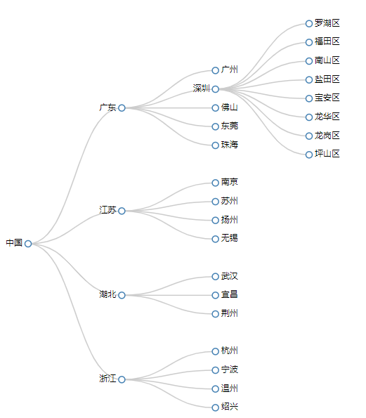
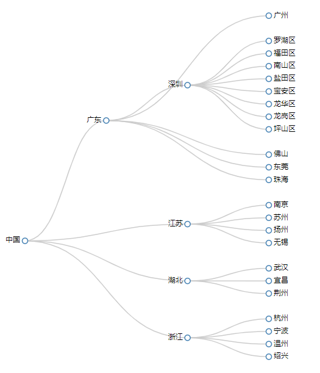

# D3.js 进阶篇： 树状图 tree

树状图（ Tree ）用于表示`层级`、`上下级`、`包含与被包含`关系。

树状图的代码和的集群图相差无几。

但两者展示的效果，根据输入的数据的不同，会有差别。

## 数据

city_tree.json

```json
{
  "name": "中国",
  "children": [
    {
      "name": "广东",
      "children": [
        { "name": "广州" },
        {
          "name": "深圳",
          "children": [
            { "name": "罗湖区" },
            { "name": "福田区" },
            { "name": "南山区" },
            { "name": "盐田区" },
            { "name": "宝安区" },
            { "name": "龙华区" },
            { "name": "龙岗区" },
            { "name": "坪山区" }
          ]
        },
        { "name": "佛山" },
        { "name": "东莞" },
        { "name": "珠海" }
      ]
    },
    {
      "name": "江苏",
      "children": [
        { "name": "南京" },
        { "name": "苏州" },
        { "name": "扬州" },
        { "name": "无锡" }
      ]
    },
    {
      "name": "湖北",
      "children": [{ "name": "武汉" }, { "name": "宜昌" }, { "name": "荆州" }]
    },
    {
      "name": "浙江",
      "children": [
        { "name": "杭州" },
        { "name": "宁波" },
        { "name": "温州" },
        { "name": "绍兴" }
      ]
    }
  ]
}
```

## 布局：数据转换

### 定义一个树状图的布局

```js
//
var tree = d3.layout
  .tree()
  .size([width, height - 200])
  .separation(function(a, b) {
    return a.parent == b.parent ? 1 : 2;
  });
```

### 创建一个对角线生成器

```js
var diagonal = d3.svg.diagonal().projection(function(d) {
  return [d.y, d.x];
});
```

## 绘图

```js
// 向服务器请求数据
d3.json("./json/city_tree.json", function(error, root) {
  // 转换后的顶点数据
  var nodes = tree.nodes(root);

  // 转换后的连接线数据
  var links = tree.links(nodes);

  console.log(nodes);
  console.log(links);

  // 绘制连线
  var link = svg
    .selectAll(".link")
    .data(links)
    .enter()
    .append("path")
    .attr("class", "link")
    .attr("d", diagonal); //使用对角线生成器

  // 添加节点
  var node = svg
    .selectAll(".node")
    .data(nodes)
    .enter()
    .append("g")
    .attr("class", "node")
    .attr("transform", function(d) {
      return "translate(" + d.y + "," + d.x + ")";
    });

  node.append("circle").attr("r", 4.5);

  // 添加描述节点的文字
  node
    .append("text")
    .attr("dx", function(d) {
      return d.children ? -8 : 8;
    })
    .attr("dy", 3)
    .style("text-anchor", function(d) {
      return d.children ? "end" : "start";
    })
    .text(function(d) {
      return d.name;
    });
});
```

## 效果图

### 1.树状图



### 2.集群图


