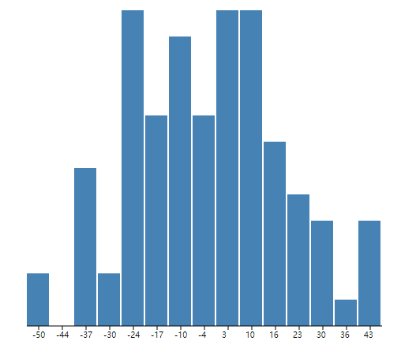

# D3.js 进阶篇: 直方图（柱状图） Histogram

直方图用于描述`概率分布`，D3 提供了直方图的布局 `Histogram` 用于转换数据。

假设有数组 `a = [10, 11, 11.5, 12.5, 13, 15, 19, 20 ]`，现在把 `10~20` 的数值范围分为 5 段，即：

10~12, 12~14, 14~16, 16~18, 18~20

那么数组 a 的各数值都落在这几段区域的哪一部分呢？经过计算，可以知道，这 5 段分别具有的元素个数为：

3, 2, 1, 0 , 2

将这个用图形展示出来的，就是直方图。

## 数据

`d3.random.normal()` 生成一个函数，这个函数能够按正态（高斯）分布随机生成数值。

```js
var rand = d3.random.normal(0, 25);
var dataset = [];
for (var i = 0; i < 100; i++) {
  dataset.push(+rand().toFixed(2)); // 保留两位小数
}
```

## 布局：数据转换

接下来，要将上述数据进行转换，即确定一个 `区间` 和 `分隔数` 之后，让数组的数值落在各区域里。

先定义一个直方图的布局：

```js
var bin_num = 15;
var histogram = d3.layout
  .histogram()
  .range([-50, 50])
  .bins(bin_num)
  .frequency(true);
```

API 解释：

- d3.layout.histogram： 直方图的布局
- range： 区间的范围
- bins： 分隔数
- frequency： 若值为 true，则统计的是个数；若值为 false，则统计的是概率

对数据进行转换：

```js
var data = histogram(dataset);
```

转换后的数组，长度即`分隔数`，每一个区间内有落到此区间的数值，数值的个数（length），还有三个参数：

- x： 区间的起始位置
- dx： 区间的宽度
- y： 落到此区间的数值的数量（如果 frequency 为 true）；落到此区间的概率（如果 frequency 为 false）

## 绘图

绘制之前，需要定义一个`比例尺`，因为通常我们需要让转换后的 `y` 在希望的范围内伸缩。

### 定义一个比例尺

```js
var max_height = 400; // 最大高度
var rect_step = 30; // 直方图的间隔
var heights = [];
for (var i = 0; i < data.length; i++) {
  heights.push(data[i].y);
}
// 定义比例尺
var yScale = d3.scale
  .linear()
  .domain([d3.min(heights), d3.max(heights)])
  .range([0, max_height]);
```

### 绘制图形

```js
var graphics = svg.append("g").attr("transform", "translate(30,20)");

//绘制矩形
graphics
  .selectAll("rect")
  .data(data)
  .enter()
  .append("rect")
  .attr("x", function(d, i) {
    return i * rect_step;
  })
  .attr("y", function(d, i) {
    return max_height - yScale(d.y);
  })
  .attr("width", function(d, i) {
    return rect_step - 2;
  })
  .attr("height", function(d) {
    return yScale(d.y);
  })
  .attr("fill", "steelblue");

//绘制坐标轴的直线
graphics
  .append("line")
  .attr("stroke", "black")
  .attr("stroke-width", "1px")
  .attr("x1", 0)
  .attr("y1", max_height)
  .attr("x2", data.length * rect_step)
  .attr("y2", max_height);

//绘制坐标轴的分隔符直线
graphics
  .selectAll(".linetick")
  .data(data)
  .enter()
  .append("line")
  .attr("stroke", "black")
  .attr("stroke-width", "1px")
  .attr("x1", function(d, i) {
    return i * rect_step + rect_step / 2;
  })
  .attr("y1", max_height)
  .attr("x2", function(d, i) {
    return i * rect_step + rect_step / 2;
  })
  .attr("y2", max_height + 5);

//绘制文字
graphics
  .selectAll("text")
  .data(data)
  .enter()
  .append("text")
  .attr("font-size", "10px")
  .attr("x", function(d, i) {
    return i * rect_step;
  })
  .attr("y", function(d, i) {
    return max_height;
  })
  .attr("dx", rect_step / 2 - 8)
  .attr("dy", "15px")
  .text(function(d) {
    return Math.floor(d.x);
  });
```

## 效果



更多内容，请参考[官方 API 文档](https://github.com/d3/d3-array#histograms)
