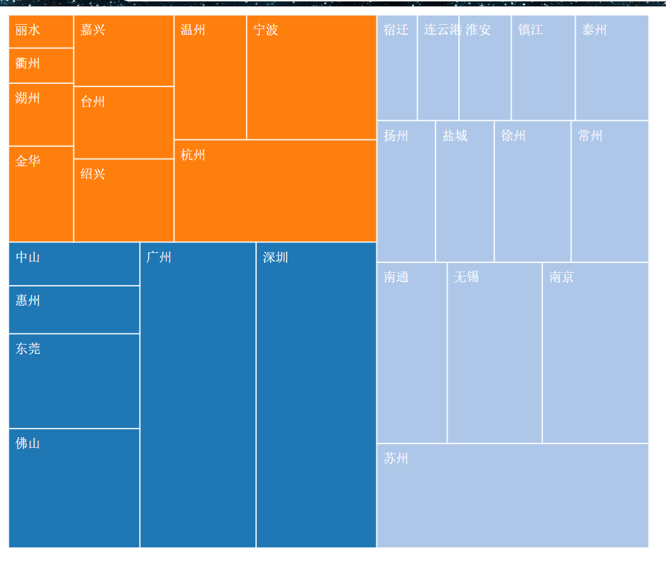

# D3.js 进阶篇: 矩阵树图 Treemap

`矩阵树图`是`层级布局`的扩展，根据数据将区域划分为矩形的集合。矩形的大小和颜色，都是数据的反映。

## 数据

本文将以广东、江苏、浙江三省份 2017 年的 GDP 作为数据，以 GDP 大小作为节点的权重将其制作成矩阵树图。

`city_gdp.json`:

```json
{
  "name": "中国",
  "children": [
    {
      "name": "广东",
      "children": [
        {
          "name": "广州",
          "gdp": 21503.15
        },
        {
          "name": "深圳",
          "gdp": 22438.39
        },
        {
          "name": "佛山",
          "gdp": 9549.6
        },
        {
          "name": "东莞",
          "gdp": 7582.12
        },
        {
          "name": "惠州",
          "gdp": 3830.58
        },
        {
          "name": "中山",
          "gdp": 3450.31
        }
      ]
    },
    {
      "name": "江苏",
      "children": [
        {
          "name": "南京",
          "gdp": 11715.1
        },
        {
          "name": "苏州",
          "gdp": 17319.51
        },
        {
          "name": "无锡",
          "gdp": 10511.8
        },
        {
          "name": "南通",
          "gdp": 7734.64
        },
        {
          "name": "常州",
          "gdp": 6622.28
        },
        {
          "name": "徐州",
          "gdp": 6605.95
        },
        {
          "name": "盐城",
          "gdp": 5082.69
        },
        {
          "name": "扬州",
          "gdp": 5064.92
        },
        {
          "name": "泰州",
          "gdp": 4744.53
        },
        {
          "name": "镇江",
          "gdp": 4105.36
        },
        {
          "name": "淮安",
          "gdp": 3387.43
        },
        {
          "name": "连云港",
          "gdp": 2640.31
        },
        {
          "name": "宿迁",
          "gdp": 2610.94
        }
      ]
    },
    {
      "name": "浙江",
      "children": [
        {
          "name": "杭州",
          "gdp": 12556.16
        },
        {
          "name": "宁波",
          "gdp": 9846.94
        },
        {
          "name": "温州",
          "gdp": 5453.17
        },
        {
          "name": "绍兴",
          "gdp": 5108.04
        },
        {
          "name": "台州",
          "gdp": 4388.22
        },
        {
          "name": "嘉兴",
          "gdp": 4355.24
        },
        {
          "name": "金华",
          "gdp": 3870.22
        },
        {
          "name": "湖州",
          "gdp": 2476.13
        },
        {
          "name": "衢州",
          "gdp": 1380
        },
        {
          "name": "丽水",
          "gdp": 1298.2
        }
      ]
    }
  ]
}
```

每一个叶子节点都包含有 name 和 gdp，name 是节点名称，gdp 是节点大小。

## 布局：数据转换

创建一个矩阵树图布局，尺寸设置为[width, height]，即 SVG 画布的尺寸，value 访问器设定为 gdp，代码如下：

```js
var treemap = d3.layout
  .treemap()
  .size([width, height])
  .value(function(d) {
    return d.gdp;
  });
```

接下来读取并转换数据:

```js
d3.json("./json/city_gdp.json", function(error, root) {
  if (error) {
    console.log(error);
  }
  console.log(root);

  //转换数据
  var nodes = treemap.nodes(root);
  var links = treemap.links(nodes);

  console.log(nodes);
  console.log(links);
});
```

节点中增加了以下几个属性：

- parent：父节点
- children：子节点
- depth：节点的深度
- value：节点的 value 值，由 value 访问器决定
- x：节点的 x 坐标
- y：节点的 y 坐标
- dx：x 方向的宽度
- dy：y 方向的宽度

各连线对象都包含有 source 和 target，分别是连线的两端。

## 绘图

本例不绘制连线，只使用节点数组。节点的绘制很简单，按节点数目添加足够的分组元素`<g>`，`<g>`里再添加`<rect>`和`<text>`。

```js
//绘制图形
var groups = svg
  .selectAll("g")
  .data(
    nodes.filter(function(d) {
      return !d.children;
    })
  )
  .enter()
  .append("g");

var rects = groups
  .append("rect")
  .attr("class", "nodeRect")
  .attr("x", function(d) {
    return d.x;
  })
  .attr("y", function(d) {
    return d.y;
  })
  .attr("width", function(d) {
    return d.dx;
  })
  .attr("height", function(d) {
    return d.dy;
  })
  .style("fill", function(d, i) {
    return color(d.parent.name);
  });

var texts = groups
  .append("text")
  .attr("class", "nodeName")
  .attr("x", function(d) {
    return d.x;
  })
  .attr("y", function(d) {
    return d.y;
  })
  .attr("dx", "0.5em")
  .attr("dy", "1.5em")
  .text(function(d) {
    return d.name + " " + d.gdp;
  });
```

## 效果


