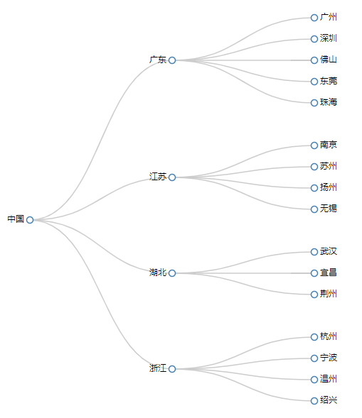

# D3.js 进阶篇： 集群图 cluster

集群图是一种用于表示`包含与被包含关系`的图表。

## 数据

```json
{
  "name": "中国",
  "children": [
    {
      "name": "广东",
      "children": [
        {
          "name": "广州"
        },
        {
          "name": "深圳"
        },
        {
          "name": "佛山"
        },
        {
          "name": "东莞"
        },
        {
          "name": "珠海"
        }
      ]
    },
    {
      "name": "江苏",
      "children": [
        {
          "name": "南京"
        },
        {
          "name": "苏州"
        },
        {
          "name": "扬州"
        },
        {
          "name": "无锡"
        }
      ]
    },
    {
      "name": "湖北",
      "children": [
        {
          "name": "武汉"
        },
        {
          "name": "宜昌"
        },
        {
          "name": "荆州"
        }
      ]
    },
    {
      "name": "浙江",
      "children": [
        {
          "name": "杭州"
        },
        {
          "name": "宁波"
        },
        {
          "name": "温州"
        },
        {
          "name": "绍兴"
        }
      ]
    }
  ]
}
```

这段数据表示 “中国 – 省份 – 城市” 的 `包含与被包含` 关系。

## 布局（数据转换）

定义一个集群图布局：

```js
var cluster = d3.layout.cluster().size([width, height - 200]);
```

size() 设定尺寸，即转换后的各节点的坐标在哪一个范围内。

接下来，应用该布局来转换数据：

```js
d3.json("./json/city.json", function(error, root) {
  // 转换后的顶点数据
  var nodes = cluster.nodes(root);
  // 转换后的连接线数据
  var links = cluster.links(nodes);

  console.log(nodes);
  console.log(links);
});
```

nodes 中有各个节点的子节点（children）、深度（depth）、名称（name）、位置（x，y）信息，其中名称（name）是 json 文件中就有的属性。

links 中有连线两端（ source , target ）的节点信息。

## 绘图

D3 已经为我们准备好了绘制的函数：`d3.svg.diagonal()` 。这是一个对角线生成器，只需要输入`两个顶点坐标`，即可生成一条`贝塞尔曲线`。

### 创建一个对角线生成器：

```js
var diagonal = d3.svg.diagonal().projection(function(d) {
  return [d.y, d.x];
});
```

projection() 是一个`坐标点变换器`，默认是 [ d.x , d.y ]，即保持原坐标不变，如果写成 [ d.y , d.x ] ，即是说对任意输入的顶点，都交换 x 和 y 坐标。

### 绘制连线：

```js
var link = svg
  .selectAll(".link")
  .data(links)
  .enter()
  .append("path")
  .attr("class", "link")
  .attr("d", diagonal); //使用对角线生成器
```

### 绘制节点

```js
// 添加节点
var node = svg
  .selectAll(".node")
  .data(nodes)
  .enter()
  .append("g")
  .attr("class", "node")
  .attr("transform", function(d) {
    return "translate(" + d.y + "," + d.x + ")";
  });

node.append("circle").attr("r", 4.5);

// 添加描述节点的文字
node
  .append("text")
  .attr("dx", function(d) {
    return d.children ? -8 : 8;
  })
  .attr("dy", 3)
  .style("text-anchor", function(d) {
    return d.children ? "end" : "start";
  })
  .text(function(d) {
    return d.name;
  });
```

## 效果图


