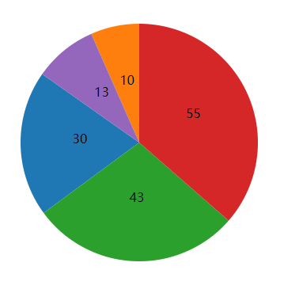

# 饼状图 Pie

## 数据

有如下数据，需要可视化：

```js
var dataset = [30, 10, 43, 55, 13];
```

这样的值是不能直接绘图的。例如绘制饼状图的一个部分，需要知道一段弧的起始角度和终止角度，这些值都不存在于数组 dataset 中。

因此，需要用到布局，布局的作用就是：`计算出适合于作图的数据`。

这一个过程，在本教程中为了方便理解，笔者称之为“数据转换”。

## 布局（数据转换）

定义一个布局，

```js
var pie = d3.layout.pie();
```

返回值赋给变量 pie，此时 pie 可以当做函数使用。

```js
var piedata = pie(dataset);
```

将数组 dataset 作为 pie() 的参数，返回值给 piedata。如此一来，`piedata` 就是转换后的数据。

在控制台输出 piedata ，让我们来看看数据转换成什么了。

```js
/* [
  { data: 30, value: 30, startAngle: 4.077828874858275, endAngle: 5.3261438365495835, padAngle: 0 },
  { data: 10, value: 10, startAngle: 5.86708031994915, endAngle: 6.283185307179586, padAngle: 0 },
  { data: 43, value: 43, startAngle: 2.288577429767399, endAngle: 4.077828874858275, padAngle: 0 },
  { data: 55, value: 55, startAngle: 0, endAngle: 2.288577429767399, padAngle: 0 },
  { data: 13, value: 13, startAngle: 5.3261438365495835, endAngle: 5.86708031994915, padAngle: 0 }
] */
```

如上所示，5 个整数被转换成了 5 个对象（Object） ，每个对象都有变量起始角度（startAngle）和终止角度（endAngle），还有原数据（属性名称为 data）。这些都是绘图需要的数据。

记住：布局不是要直接绘图，而是`为了得到绘图所需的数据`。

## 绘制图形

为了根据转换后的数据 piedata 来作图，还需要一样工具：`生成器`。

SVG 有一个元素，叫做路径 `<path>`，是 SVG 中功能最强的元素，它可以表示其它任意的图形。顾名思义，路径元素就是通过定义一个段“路径”，来绘制出各种图形。

但是，路径是很难计算的，通过布局转换后的数据 piedata 仍然很难手动计算得到路径值。为我们完成这项任务的，就是`生成器`。

这里要用到的叫做`弧生成器`，能够生成弧的路径，因为饼图的每一部分都是一段弧。

```js
var outerRadius = 150; //外半径
var innerRadius = 0; //内半径，为 0 则中间没有空白

var arc = d3.svg
  .arc() //弧生成器
  .innerRadius(innerRadius) //设置内半径
  .outerRadius(outerRadius); //设置外半径
```

弧生成器返回的结果赋值给 `arc`。此时，arc 可以当做一个`函数`使用，把 `piedata` 作为参数传入，即可得到路径值。

接下来，可以在 SVG 中添加图形元素了。先在 `<svg>` 里添加足够数量（5 个）个分组元素（g），每一个分组用于存放一段弧的相关元素。

```js
var arcs = svg
  .selectAll("g")
  .data(piedata)
  .enter()
  .append("g")
  .attr("transform", "translate(" + width / 2 + "," + width / 2 + ")");
```

接下来对每个 <g> 元素，添加 <path> 。

```js
arcs
  .append("path")
  .attr("fill", function(d, i) {
    return color(i);
  })
  .attr("d", function(d) {
    return arc(d); //调用弧生成器，得到路径值
  });
```

因为 arcs 是同时选择了 5 个 `<g>` 元素的选择集，所以调用 `append("path")` 后，每个 `<g>` 中都有 `<path>` 。路径值的属性名称是 d，调用弧生成器后返回的值赋值给它。要注意，`arc(d)` 的参数 `d` 是`被绑定的数据`。

另外，`color` 是一个`颜色比例尺`，它能根据传入的索引号获取相应的颜色值，定义如下。

```js
var color = d3.scale.category10(); //有十种颜色的颜色比例尺
```

然后在每一个弧线中心添加文本。

```js
arcs
  .append("text")
  .attr("transform", function(d) {
    return "translate(" + arc.centroid(d) + ")";
  })
  .attr("text-anchor", "middle")
  .text(function(d) {
    return d.data;
  });
```

arc.centroid(d) 能算出弧线的中心。

注意，text() 里返回的是 d.data ，而不是 d 。因为被绑定的数据是对象，里面有 d.startAngle、d.endAngle、d.data 等，其中 `d.data` 才是转换前的整数的值。

## 效果


